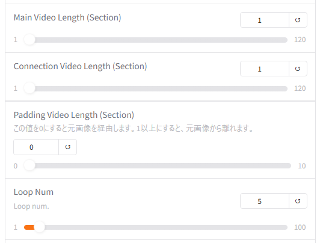

# FramePackLoop

**FramePackLoop** は、lllyasviel氏の **lllyasviel/FramePack** をベースに、ループに特化した機能拡張を施したソフトウェアです。

本機能はFramePackの基本機能を応用した実験的な実装であり、将来的に使用できなくなる可能性がある点をあらかじめご理解ください。


## 背景

ループ動画は、動画の待機画面、背景、アイコン、スタンプなど、さまざまな用途で活用されています。  
FramePackのデフォルト実装では、1枚のイメージ画像から動画を生成するソフトが付属していましたが、アニメーションの始端と終端を自然につなげる機能はなく、ループ動画の作成には適していませんでした。

また、キーフレームを設定できるソフトウェアも開発されつつありますが、単に同じ画像を始端と終端に指定するだけでは、滑らかにループできないという課題もありました。

**FramePackLoop** はこの課題に対して、FramePack本来の実装を活用し、  
滑らかに始端と終端をつなげることができるかを検証するために開発されました。


## FramePackLoopの基礎知識

FramePackLoopでは、以下の手順でループ動画が生成されます。

1. メイン動画の作成
2. メイン動画の始端と終端をつなげる接続動画の作成
3. メイン動画と接続動画を結合して1ループ動画の作成
4. 1ループ動画を繰り返してループ動画を作成

また、FramePackLoopでは動画の長さを「秒」ではなく「セクション」という単位で管理します。  
1セクションはおおよそ1秒程度ですが、厳密には1秒ではありません。


## パラメータの説明

FramePackLoopでは、本家FramePackに対して以下のパラメータが変更・追加されています。



- **Main Video Length**  
  メイン動画のセクション数です。

- **Connection Video Length**  
  接続動画のセクション数です。メイン動画のセクション数と同じにするのが理想ですが、小さくても問題ありません。

> 全体の動画長は、  
> `Main Video Length + Connection Video Length`  
> になります。  
> 例：Main Video Length=1、Connection Video Length=1 → 約2秒

- **Padding Video Length**  
  - `0` にすると、入力画像から直接始まるループ動画になります。
  - `0` 以外にすると、少しアニメーションした後からループを開始します。
  - 違和感が出る場合や、設定画像を使用する場合は1以上を推奨します（最大3程度が目安）。

- **Loop Num**  
  出力するループ回数です。  
  1ループ動画をコピーする方式なので、大きな数値にしても処理時間はそれほど増加しません。


## 出力ファイル

`output` フォルダに以下のファイルが出力されます。（その他のファイルは削除しても問題ありません）

- `XXXX_1loop.mp4`  
  - 1ループ分の動画です。動画編集ツールや配信ソフトでループ再生してご利用ください。
  - ※使用する編集ソフトによってはフレーム落ちによって正常にループしない場合もあります（CapCutとOBS Studioでは正常動作を確認済み）。

- `XXXX_loop_{Loop Num}.mp4`  
  - 1ループ動画を連結した長尺の動画です。


## インストールと実行方法

インストール方法は本家FramePackと同様です。  
環境構築後、以下のコマンドを実行してください。

```bash
python demo_gradio_loop.py
```

FramePackを既にインストール済みの方は、demo_gradio_loop.pyを本家のdemo_gradio.pyのあるフォルダにおいていただき、上のコマンドを実行すれば起動できます。

## 少しだけ技術解説

本ソフトでは「接続動画」の生成にフォーカスしています。  
FramePackでは、セクションごとの動画生成時に、入力画像と「未来側の次のセクション」の情報を参照して生成していました。

**FramePackLoop** では、接続動画生成時に「未来」だけでなく、「過去側の前のセクション」の情報も参照するように拡張しました。（※未検証）

ここではループ動画を前提としていますので、過去と未来は以下の通りです。

- **未来**：メイン動画の始端周辺
- **過去**：メイン動画の終端周辺

FramePackにはもともと未来情報を付与する仕組みがありましたが、  
過去情報も付与できるか試してみたところ、**良好な結果が得られた**ため、ループ動画作成ソフトウェアとしてまとめることにしました。  
（※ただし、効果の正式な検証は行っていません。）

また、FramePackの元実装にあった「セクション動画のオーバーラッピング」も、滑らかに動画をつなげる上で有効に感じられました。


## 今後の予定

将来的にLoRA対応やキーフレーム対応を行う可能性もありますが、  
本ソフトウェアの開発動機は「過去・未来フレームの同時参照の検証」であるため、現時点では対応は未定です。


## 謝辞

ありがとう、lllyasviel！

