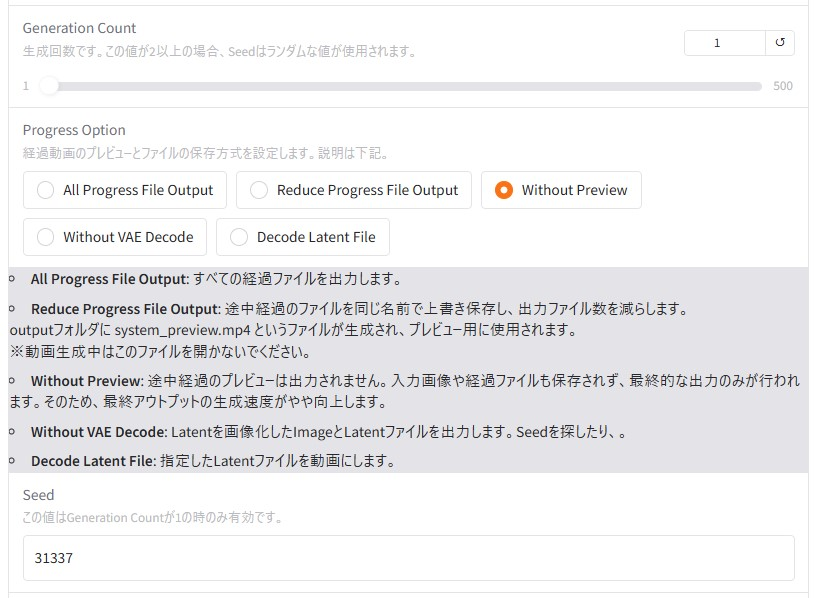
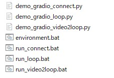

# FramePackLoop

**FramePackLoop** は、lllyasviel氏の **lllyasviel/FramePack** をベースに、ループに特化した機能拡張を施したソフトウェアです。

本機能はFramePackの基本機能を応用した実験的な実装であり、将来的に使用できなくなる可能性がある点をあらかじめご理解ください。


## 背景

ループ動画は、動画の待機画面、背景、アイコン、スタンプなど、さまざまな用途で活用されています。  
FramePackのデフォルト実装では、1枚のイメージ画像から動画を生成するソフトが付属していましたが、アニメーションの始端と終端を自然につなげる機能はなく、ループ動画の作成には適していませんでした。

また、キーフレームを設定できるソフトウェアも開発されつつありますが、単に同じ画像を始端と終端に指定するだけでは、滑らかにループできないという課題もありました。

**FramePackLoop** はこの課題に対して、FramePack本来の実装を活用し、  
滑らかに始端と終端をつなげることができるかを検証するために開発されました。


## FramePackLoopの基礎知識

FramePackLoopでは、以下の手順でループ動画が生成されます。

1. メイン動画の作成
2. メイン動画の始端と終端をつなげる接続動画の作成
3. メイン動画と接続動画を結合して1ループ動画の作成
4. 1ループ動画を繰り返してループ動画を作成

また、FramePackLoopでは動画の長さを「秒」ではなく「セクション」という単位で管理します。  
1セクションはおおよそ1秒程度ですが、厳密には1秒ではありません。


## パラメータの説明

FramePackLoopでは、本家FramePackに対して以下のパラメータが変更・追加されています。


- **Main Video Length**  
  メイン動画のセクション数です。   

- **Connection Video Length**  
  接続動画のセクション数です。メイン動画のセクション数と同じにするのが理想ですが、小さくても問題ありません。

> 全体の動画長は、  
> `Main Video Length + Connection Video Length`  
> になります。  
> 例：Main Video Length=1、Connection Video Length=1 → 約2秒

- **Padding Video Length**  
  - `0` にすると、入力画像から直接始まるループ動画になります。
  - `0` 以外にすると、少しアニメーションした後からループを開始します。  
  Padding Video Length Checkerの値が変わらない場合は変更の効果は得られません。
  - 違和感が出る場合や、設定画像を使用する場合は1以上を推奨します（最大3程度が目安）。
  

- **Loop Num**  
  出力するループ回数です。  
  1ループ動画をコピーする方式なので、大きな数値にしても処理時間はそれほど増加しません。

### 動画生成を繰り返したい人向けのパラメタ
夜間などに動画生成を繰り返し実行したい方のために、動画生成を繰り返すパラメータを用意しました。



- **Generation Count**  
動画の生成回数を設定します。指定した回数だけ動画が生成されます。  
**Generation Countが2以上の場合、Seedはランダムな値が使用されます。**  
現在の生成回数は、プレビューの下に「Generation Index」として表示されます（カウントは1から始まります）。

- **Progress Option**  
経過動画のプレビューとファイルの保存方式です。 
  - **All Progress File Output**: すべての経過ファイルを出力します。  
  - **Reduce Progress File Output**: 途中経過のファイルを同じ名前で上書き保存し、出力ファイル数を減らします。  
  outputフォルダに system_preview.mp4 というファイルが生成され、プレビュー用に使用されます。  
  ※動画生成中はこのファイルを開かないでください。  
  - **Without Preview**: 途中経過のプレビューは出力されません。入力画像や経過ファイルも保存されず、最終的な出力のみが行われます。そのため、最終アウトプットの生成速度がやや向上します。   
  - **"Without VAE Decode"**: （上級者向け）Latentを画像化したImageとLatentファイルを出力します。  
  VAEデコードを行わない分１回あたりの生成時間が短くなります。
  - **Decode Latent File**: （上級者向け）指定したLatentファイルを動画にします。 
- **Seed**  
動画生成時に使用されるSeed値です。  
この値は、Generation Countが1の場合のみ有効です。  
動画生成に使用されたSeedは生成された動画のファイル名に記録されます。

### Without VAE DecodeモードおよびDecode Latent Fileモードのユースケース
1. Seed探し  
FramePackでは、動作の内容が使用するSeedに大きく依存します。そのため、好みの動作を実現するSeedを見つけることが重要な場合があります。  
短い動画であれば、各Seedでどのような動作が生成されるかをLatent画像を確認することで、ある程度推測できます。  


「Without VAE Decode」モードを使用して、Step数を10程度に設定し、多数のLatent画像を生成することで、好みの動作をしそうなSeedを効率的に見つけることが期待できます。
その後、見つけたSeedを固定し、Step数を25に設定して動画を再生成することで、狙った動作に近い映像を得やすくなります。

2. 大量生成
FramePackでは、好みではない動作を含む動画が生成されることも少なくありません。こうした動画に対してVAEデコードを行う時間は、無駄になる場合があります。  

そのため、大量生成を行う際は、LatentイメージとLatentファイルのみを先に大量に生成しておき、あとから好みの動作が含まれていそうなLatentイメージのみをVAEデコードして動画化することで、効率よく好みの動作を含む動画を得られる可能性が高まります。  

このケースでは「Without VAE Decode」モードを使用して、Step数を25に設定して動画生成を行います。

### Latent Fileのデコード方法
1. Latentファイルを以下のUIを利用してアップロードします。  

2. SeedにLatent Fileを生成した時のSeedを設定します。
3. Generation Countは1にします。
4. Decode Latent Fileにチェックを入れます。
5. Start Generationでデコードを開始します。

Latentファイルをデコードする際は、Step等のパラメタは基本的にそのLatentファイルを生成した時と同じ設定値にする必要があります。
デコードした際に出力される動画のファイル名は、Latentファイルと似たインデックスになります。

## 出力ファイル

`output` フォルダに以下のファイルが出力されます。（その他のファイルは削除しても問題ありません）

- `XXXX_{Seed}_1loop.mp4`  
  - 1ループ分の動画です。動画編集ツールや配信ソフトでループ再生してご利用ください。
  - ※使用する編集ソフトによってはフレーム落ちによって正常にループしない場合もあります（CapCutとOBS Studioでは正常動作を確認済み）。

- `XXXX_{Seed}_loop_{Loop Num}.mp4`  
  - 1ループ動画を連結した長尺の動画です。

- `XXXX_{Seed}_latent.png`  
  - latentファイルを画像化したものです。
- `XXXX_{Seed}_latent.pt`  
  - latentファイルです。


## インストールと実行方法

インストール方法は本家FramePackと同様です。  
環境構築後、以下のコマンドを実行してください。

```bash
python demo_gradio_loop.py
```

FramePackを既にインストール済みの方は、demo_gradio_loop.pyを本家のdemo_gradio.pyのあるフォルダにおいていただき、上のコマンドを実行すれば起動できます。  

FramePackの2025/04/28のmainブランチ（コミット番号 6da55e8）で動作確認しました。
コピーして使用される方はここまでのアップデートをお願いします。

### 限定的なWindowsパッケージサポート

限定的なサポートとなりますが、FramePackのWindowsパッケージをご利用の方向けに、簡単にFramePackLoopを追加できる追加パッケージを用意しました。  
※FramePackのWindows版がインストールされていることが前提となります。

オリジナルの実装に依存した限定的なサポートとなりますので将来的にサポートできなくなる可能性がある点ごご理解ください。  
また、オリジナルパッケージには影響を与えない設計を心がけていますが、万が一問題が発生した場合はご容赦ください。


[>>> 追加パッケージをダウンロードするにはここをクリックしてください <<<](https://github.com/red-polo/FramePackLoop/releases/download/windows-v1.6/run_loop.zip)


ダウンロードしたファイルに入っているrun_loopフォルダを、FramePackのWindows版インストールフォルダに、下図のように配置してください。


次に、run_loopフォルダ内のrun_loop.batを実行すると、FramePackLoopが起動します。
出力ファイルは、run_loopフォルダ内のoutputフォルダに保存されます。



アンインストールする際は、run_loopフォルダを削除してください。


## LoRAの使い方
FramePackLoopではLoRAを使用できます。  
フォルダ内にある `lora_setting.json` ファイルを、**FramePackLoopの起動前に編集**してください。


記入内容は`lora_setting_sample.json` を参考にしてください。例えば以下のように、LoRAファイルへのパスと適用スケールを記入します。

```json
[
    {
        "file":"./lora_models/lora1.safetensors",
        "scale":1.0
    }
]
```

設定後にFramePackLoopを起動すると、コンソール上に以下のようなLoRAの読み込み状況が表示されます。正しくLoRAが読み込まれているかをご確認ください。


注意：LoRAは起動中に動的に変更することはできません。LoRAを変更したい場合は、お手数ですが一度アプリケーションを再起動してください。


LoRAは[Musubi Tuner](https://github.com/kohya-ss/musubi-tuner)で作成されたFramePack用のLoRAを使用するのが最も効果的ですが、  
HunyuanVideo用のLoRAも効果が得られるケースがあるようです。

## システムオプション
### Latentの動画化
system_setting.jsonのpreview.typeを"video"にすることでnext latentの表示を動画にすることができます。
outputフォルダ中に"preview.mp4"というファイルが生成されますが、動画生成処理実行中は開かないで下さい。開いた場合は生成がエラーになる可能性があります。
Next Latentの表示を画像から動画にします。  
```
{
    "preview":{
        "type":"video",
        "height":200
    } 
}
```


## 少しだけ技術解説

<span style="font-size: 200%; color: red;">重要なお知らせ(2025/05/02)</span>

追加検証を行った結果、残念ながら過去の情報はほぼ反映されないという判断に至りました。  
過去の動きの情報を反映できていると期待を寄せていただいた方は申し訳ございません。

追加で検証を行った結果、過去の時間のフレームを参照させてもほとんど効果がないと判断しました。
過去フレームの参照以外にも動画的に綺麗につながるようにいくつかの工夫は行っているため、生成動画はループ状に**動画的**には綺麗につながるのですが、
**動作**がスムーズにループするか否かはほぼ運によって決まると考えられます。

私自身さらにFramePackを学び過去の情報が参照できるかを検討しましたが、
過去の情報が参照できるかはモデルによるところが大きいと考えられるため、直近すぐに反映することは難しそうです。


一方で、私自身が本ツールを使用し、多くの方にご利用いただく中で、たとえ「運」によるものであっても、完成度の高いループ素材が生成される場合があることは実感しております
ツールの非公開化も検討しましたが、ご愛用いただいているユーザーがいらっしゃることから、
今後も公開は継続し、運に左右される要素があるという点をご理解のうえで、ご利用いただければと考えております。


~~本ソフトでは「接続動画」の生成にフォーカスしています。  
FramePackでは、セクションごとの動画生成時に、入力画像と「未来側の次のセクション」の情報を参照して生成していました。~~

~~**FramePackLoop** では、接続動画生成時に「未来」だけでなく、「過去側の前のセクション」の情報も参照するように拡張しました。（※未検証）~~

~~ここではループ動画を前提としていますので、過去と未来は以下の通りです。~~

~~- **未来**：メイン動画の始端周辺~~
~~- **過去**：メイン動画の終端周辺~~

~~FramePackにはもともと未来情報を付与する仕組みがありましたが、  
過去情報も付与できるか試してみたところ、**良好な結果が得られた**ため、ループ動画作成ソフトウェアとしてまとめることにしました。  
（※ただし、効果の正式な検証は行っていません。）~~


また、FramePackの元実装にあった「セクション動画のオーバーラッピング」も、滑らかに動画をつなげる上で有効に感じられました。


# FramePackConnect（beta）

**FramePackConnect** は、lllyasviel氏の **lllyasviel/FramePack** をベースに、動画間をスムーズに補完する機能を提供するソフトウェアです。

動画間の補完は動画作成で長尺の動画を作成する際に役立つのはもちろん、ゲーム作成においてループ素材を滑らかにつなげる際の素材等にも有用です。

本機能はFramePackの基本機能を応用した実験的な実装であり、将来的に使用できなくなる可能性がある点をあらかじめご理解ください。

## FramePackConnectの簡単な使い方


FramePackで作成した結合したい動画を２つ用意します。  
動画は以下の条件を満たす必要があります。
* １秒以上であること。３秒以上が望ましいです。
* FramePackで作成された、同じ画面の大きさの動画であること。

先頭の動画を左側HeadVideoにアプロードしてください。
末尾の動画を右側TailVideoにアップロードしてください。

結合する部分のPromptを入れ、StartGenerationボタンを押すと生成が開始されます。  
outputフォルダに結合された動画のファイルが出力されます。

※元の動画は殆どの部分が維持されますが、動画をつなげる過程で多少変わります。

## パラメータの説明

FramePackConnectでは、FramePackに対して以下のパラメータが変更・追加されています。


- **Connect Video Length**  
  補完のために生成する動画のセクション数です。  

### 動画生成を繰り返したい人向けのパラメタ
FramePackLoopと同様です。

## 出力ファイル

`output` フォルダに以下のファイルが出力されます。

- `XXXX_{Seed}_connect.mp4`  
  - ２つの動画が補完された動画です。


## インストールと実行方法

インストール方法は本家FramePackと同様です。  
環境構築後、以下のコマンドを実行してください。

```bash
python demo_gradio_connect.py
```

FramePackを既にインストール済みの方は、demo_gradio_connect.pyを本家のdemo_gradio.pyのあるフォルダにおいていただき、上のコマンドを実行すれば起動できます。  

FramePackの2025/04/28のmainブランチ（コミット番号 6da55e8）で動作確認しました。
コピーして使用される方はここまでのアップデートをお願いします。

## 制限事項
・後ろの動画が３秒以下の場合、動画の最後が数フレーム切れる場合があります。
・処理経過のファイルやプレビューは表示されません。

### 限定的なWindowsパッケージサポート

限定的なサポートとなりますが、FramePackのWindowsパッケージをご利用の方向けに、簡単にFramePackConnectを追加できる追加パッケージを用意しました。  
※FramePackのWindows版がインストールされていることが前提となります。

オリジナルの実装に依存した限定的なサポートとなりますので将来的にサポートできなくなる可能性がある点ごご理解ください。  
また、オリジナルパッケージには影響を与えない設計を心がけていますが、万が一問題が発生した場合はご容赦ください。


[>>> 追加パッケージをダウンロードするにはここをクリックしてください <<<](https://github.com/red-polo/FramePackLoop/releases/download/windows-v1.6/run_loop.zip)


ダウンロードしたファイルに入っているrun_loopフォルダを、FramePackのWindows版インストールフォルダに、下図のように配置してください。


次に、run_loopフォルダ内のrun_connect.batを実行すると、FramePackConnectが起動します。
出力ファイルは、run_loopフォルダ内のoutputフォルダに保存されます。


アンインストールする際は、run_loopフォルダを削除してください。

# FramePackVideo2LoopVideo(beta)

**FramePackVideo2LoopVideo** は、lllyasviel氏の **lllyasviel/FramePack**で作成された動画を入力して、ループ化した動画を生成するソフトウェアです。

FramePack-F1の登場により、動画からループ動画を作成したいというニーズが出てきたため作成しました。

本ソフトウェアは開発中であり、仕様が変更になる可能性があります。

また、本機能はFramePackの基本機能を応用した実験的な実装であり、将来的に使用できなくなる可能性がある点をあらかじめご理解ください。

## FramePackVideo2LoopVideoの簡単な使い方


FramePackで作成した、ループ化したい動画を用意します。  
動画は以下の条件を満たす必要があります。
* １秒以上であること。３秒以上が望ましいです。
* FramePackで作成された動画であること

動画をInputVideoにアプロードしてください。

Promptを入れ、StartGenerationボタンを押すとループ動画の生成が開始されます。  
outputフォルダに結合された動画のファイルが出力されます。

※注意点  
- 元の動画は殆どの部分が維持されますが、動画をつなげる過程で多少変わります。
- 元の動画の後ろ数フレームはなくなる場合があります。
- 元の動画の一番最初のフレームと一番最後ののフレームがあまり変わらないとループが上手く出来ない場合があります。

## パラメータの説明

FramePackLoopでは、本家FramePackに対して以下のパラメータが変更・追加されています。


- **Connection Video Length**  
  接続動画のセクション数です。おおよそ１セクションで１秒です。

- **Loop Num**  
  出力するループ回数です。  
  1ループ動画をコピーする方式なので、大きな数値にしても処理時間はそれほど増加しません。

### 動画生成を繰り返したい人向けのパラメタ
FramePackLoopと同様です。

## 出力ファイル

`output` フォルダに以下のファイルが出力されます。（その他のファイルは削除しても問題ありません）

- `XXXX_{Seed}_1loop.mp4`  
  - 1ループ分の動画です。動画編集ツールや配信ソフトでループ再生してご利用ください。
  - ※使用する編集ソフトによってはフレーム落ちによって正常にループしない場合もあります（CapCutとOBS Studioでは正常動作を確認済み）。

- `XXXX_{Seed}_loop_{Loop Num}.mp4`  
  - 1ループ動画を連結した長尺の動画です。


## インストールと実行方法

インストール方法は本家FramePackと同様です。  
環境構築後、以下のコマンドを実行してください。

```bash
python demo_gradio_video2loop.py
```

FramePackを既にインストール済みの方は、demo_gradio_video2loop.pyを本家のdemo_gradio.pyのあるフォルダにおいていただき、上のコマンドを実行すれば起動できます。  

FramePackの2025/04/28のmainブランチ（コミット番号 6da55e8）で動作確認しました。
コピーして使用される方はここまでのアップデートをお願いします。

### 限定的なWindowsパッケージサポート

限定的なサポートとなりますが、FramePackのWindowsパッケージをご利用の方向けに、簡単にFramePackVideo2LoopVideoを追加できる追加パッケージを用意しました。  
※FramePackのWindows版がインストールされていることが前提となります。

オリジナルの実装に依存した限定的なサポートとなりますので将来的にサポートできなくなる可能性がある点ごご理解ください。  
また、オリジナルパッケージには影響を与えない設計を心がけていますが、万が一問題が発生した場合はご容赦ください。


[>>> 追加パッケージをダウンロードするにはここをクリックしてください <<<](https://github.com/red-polo/FramePackLoop/releases/download/windows-v1.6/run_loop.zip)


ダウンロードしたファイルに入っているrun_loopフォルダを、FramePackのWindows版インストールフォルダに、下図のように配置してください。


次に、run_loopフォルダ内のrun_video2loop.batを実行すると、FramePackVideo2LoopVideoが起動します。
出力ファイルは、run_loopフォルダ内のoutputフォルダに保存されます。


アンインストールする際は、run_loopフォルダを削除してください。


# 今後の予定

未定です。


# 謝辞

ありがとう、lllyasviel！
ありがとう、kohya-ss！
